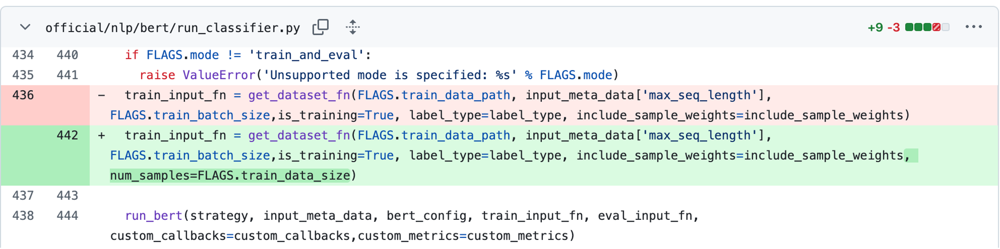
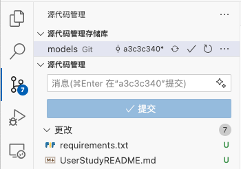

# 用户实验介绍

## 环境配置
请通过以下命令配置环境，用于测试编辑结果：
```bash
conda create --name user_study python=3.11 -y
conda activate user_study
pip install tensorflow==2.18.0
pip install gin-config
pip install absl-py==1.4.0
```

## 任务介绍
我们希望添加一个新的参数 `num_samples` 来控制加载的训练集样本数量。首个编辑发生在 [`official/nlp/bert/run_classifier.py`](official/nlp/bert/run_classifier.py) 文件中，我们为函数 `get_dataset_fn` 添加了新的参数 `num_samples`，由尚未定义的 `FLAGS.train_data_size` 传入，如图所示：



请你在完成所示修改后，继续对项目进行 **另外 8 处** 修改。你可以打开源代码管理工具，查看修改的数量，确保你确实完成了 8 处修改，如图所示：



如果你觉得修改的次数不够，可以继续修改，直到实现编辑目标（即通过 [验证修改](#验证修改) 中的测试）


## 温馨提示
1. `FLAGS.train_data_size` 的默认值是 `None`，可能被设置的比实际训练集样本数量大，请注意这一点。
2. Tensorflow 项目使用 `tf.data.TFRecordDataset` 来加载数据集:
    ```python
    dataset = tf.data.TFRecordDataset(file_path)
    ```
3. Tensorflow 提供了 `tf.data.Dataset.take` 方法来控制数据集的样本数量：
    ```python
    dataset = dataset.take(num_samples)
    ```
4. 为了优化数据集加载效率，请在从文件加载数据集之后，立刻控制数据集的样本数量。

## 验证修改
请运行以下命令验证修改：
```bash
python -m test.test
```

当修改正确时，测试会输出以下信息：
```bash
2025-03-04 10:55:58.334698: I tensorflow/core/util/port.cc:153] oneDNN custom operations are on. You may see slightly different numerical results due to floating-point round-off errors from different computation orders. To turn them off, set the environment variable `TF_ENABLE_ONEDNN_OPTS=0`.
2025-03-04 10:55:58.343590: E external/local_xla/xla/stream_executor/cuda/cuda_fft.cc:477] Unable to register cuFFT factory: Attempting to register factory for plugin cuFFT when one has already been registered
WARNING: All log messages before absl::InitializeLog() is called are written to STDERR
E0000 00:00:1741056958.352768  153584 cuda_dnn.cc:8310] Unable to register cuDNN factory: Attempting to register factory for plugin cuDNN when one has already been registered
E0000 00:00:1741056958.355552  153584 cuda_blas.cc:1418] Unable to register cuBLAS factory: Attempting to register factory for plugin cuBLAS when one has already been registered
2025-03-04 10:55:58.366280: I tensorflow/core/platform/cpu_feature_guard.cc:210] This TensorFlow binary is optimized to use available CPU instructions in performance-critical operations.
To enable the following instructions: AVX2 AVX512F AVX512_VNNI AVX512_BF16 FMA, in other operations, rebuild TensorFlow with the appropriate compiler flags.
I0000 00:00:1741056959.710484  153584 gpu_device.cc:2022] Created device /job:localhost/replica:0/task:0/device:GPU:0 with 20953 MB memory:  -> device: 0, name: NVIDIA RTX A5000, pci bus id: 0000:01:00.0, compute capability: 8.6
Test 1 passed: 1/3
Test 2 passed: 2/3
2025-03-04 10:56:00.020695: I tensorflow/core/kernels/data/tf_record_dataset_op.cc:370] TFRecordDataset `buffer_size` is unspecified, default to 262144
2025-03-04 10:56:00.024693: I tensorflow/core/framework/local_rendezvous.cc:405] Local rendezvous is aborting with status: OUT_OF_RANGE: End of sequence
Test 3 passed: 3/3
```
当 3 个测试都显示 `Test passed` 时，说明你已经完成了所有修改。